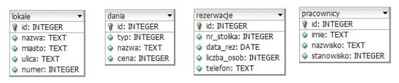

**Zadanie egzaminacyjne** 

Wykonaj aplikację internetową restauracji. Wykorzystaj pakiet XAMPP oraz edytor tekstowy zaznaczający składnię. 

Archiwum ZIP o nazwie *zad1.zip* zabezpieczone hasłem: **Wykon@jTo** 

Archiwum należy rozpakować. 

Na końcu każdej lekcji pliki wyślij do repozytorium.
Brak commita po lekcji równa się brakowi pracy na lekcji co bedzie skutkować 1 za pracę na lekcji.

**Operacje na bazie danych** 

Tabele wykorzystane w zadaniu są przedstawione na obrazie 1. Pole typ z tabeli dania odpowiada rodzajom dań: 1 – zupy, 2 – mięsne, 3 – przekąski, 4 – napoje. Pole stanowisko z tabeli pracownicy odpowiada stanowiskom: 1 – kucharz, 2 – pomoc, 3 – kelner, 4 – barman.  

**Obraz 1. Baza danych** 

Za pomocą narzędzia phpMyAdmin wykonaj operacje na bazie danych: 

- Utwórz nową bazę danych o nazwie *baza* 
- Zaimportuj do bazy tabele z pliku *baza.sql*, z wcześniej rozpakowanego archiwum. Wykonaj zrzut ekranu po imporcie. Zrzut zapisz w formacie JPEG i nazwij *zad1*. Nie kadruj zrzutu. Zrzut powinien obejmować cały ekran, z widocznym paskiem zadań. Na zrzucie powinny być widoczne elementy wskazujące na poprawnie wykonany import tabel. 
- Zapisz i wykonaj zapytania SQL działające na bazie. Wykonaj zrzuty ekranu przedstawiające wyniki działania kwerend. Zrzuty zapisz w formacie JPEG i nadaj im nazwy *kw1*, *kw2*, *kw3*, *kw4*. Zrzuty powinny obejmować cały ekran monitora z widocznym paskiem zadań. Zapytania zapisz w pliku *kwerendy.txt* 
  - Zapytanie 1: wstawiające do tabeli rezerwacje rekord z danymi: numer stolika = 1, data=„2017-07- 04”, liczba osób = 4, numer telefonu = „111222333”, wartość pola id nadawana jest automatycznie 
  - Zapytanie 2: wybierające z tabeli dania jedynie pola nazwa i cena dla dań mięsnych 
  - Zapytanie 3: wybierające z tabeli dania jedynie pole nazwa dla takich przekąsek, których cena jest mniejsza od 15 zł 
  - Zapytanie  4:  aktualizujące  dane  w  tabeli  pracownicy.  Dla  wszystkich  pracowników,  którzy zatrudnieni są jako kelner, należy dokonać zmiany stanowiska na barman  

**Witryna internetowa** 

**Obraz 2. Witryna internetowa** 

Wymagania dotyczące witryny: 

- Nazwa pliku: *restauracja.html* 
- Zastosowany język HTML 5 
- Zastosowany właściwy standard kodowania polskich znaków 
- Tytuł strony widoczny na karcie przeglądarki: „Restauracja Wszystkie Smaki” 
- Arkusz stylów w pliku o nazwie *styl\_1.css* prawidłowo połączony z kodem strony 
- Podział strony na bloki: baner, panele lewy i prawy, dolny, stopka. Podział zrealizowany za pomocą znaczników  sekcji  tak,  aby  układ  bloków  strony  po  uruchomieniu  w  przeglądarce,  był  zgodny z Obrazem 2 
- Zawartość banera: nagłówek pierwszego stopnia o treści: Witamy w restauracji „Wszystkie Smaki” 
- Zawartość panelu lewego: obraz *menu.jpg* z tekstem alternatywnym o treści: „Nasze danie” 
- Zawartość panelu prawego: 
  - Nagłówek czwartego stopnia o treści: „U nas dobrze zjesz!” 
  - Lista numerowana z trzema elementami: Obiady od 40 zł; Przekąski od 10 zł; Kolacje od 20 zł 
- Zawartość panelu dolnego: 
  - Nagłówek drugiego stopnia o treści: „Zarezerwuj stolik on-line” 
  - Formularz  zgodny  z  obrazem  2,  wysyłający  dane  do  pliku  *rezerwacja.php*  metodą  bezpieczną, zawiera podpisy i pola: 
    - „Data (format rrrr-mm-dd):”, poniżej pole edycyjne 
    - „Ile osób?”, poniżej pole edycyjne typu numerycznego 
    - „Twój numer telefonu:”, poniżej pole edycyjne 
    - Pole wyboru z napisem: „Zgadzam się na przetwarzanie moich danych osobowych” 
    - Przycisk „WYCZYŚĆ”, po jego wciśnięciu formularz jest czyszczony 
    - Przycisk „REZERWUJ”, po jego wciśnięciu są wysyłane dane z formularza  
- Zawartość stopki: napis o treści: „Stronę internetową opracował: ”, dalej wstawiony Twój numer PESEL, lub w przypadku jego braku, inny numer, którym został podpisany arkusz, numer powinien być zapisany pochyloną czcionką 

**Styl CSS witryny internetowej** 

Plik CSS* zawiera formatowanie: 

- Całej strony: kolor tła #F6E5DC, krój czcionki Verdana 
- Banera: kolor tła #2F180C, wyrównanie tekstu do środka, kolor czcionki khaki, wysokość 60 px 
- Panelu lewego: szerokość 60% 
- Panelu prawego: rozmiar czcionki 150%, marginesy wewnętrzne 70 px 
- Panelu dolnego: kolor tła #D0B6A8, wyrównanie tekstu do środka, marginesy wewnętrzne 30 px 
- Stopki: kolor tła #2F180C, kolor czcionki khaki, wysokość 60 px 
- Obrazu: wysokość 350 px 
- Obu przycisków: marginesy zewnętrzne 10 px, wewnętrzne 5 px, kolor tła #2F180C, kolor czcionki khaki 

**Skrypt połączenia z bazą** 

W tabeli 1 podano wybór funkcji PHP do obsługi bazy danych. Wymagania dotyczące skryptu: 

- Napisany w języku PHP, w pliku o nazwie *rezerwacja.php* 
- Jest uruchamiany po wypełnieniu formularza i wciśnięciu przycisku REZERWUJ. Nie jest wymagane sprawdzenie poprawności danych wpisanych w formularz  
- Wypisuje tekst „Dodano rezerwację do bazy” 
- Łączy się z serwerem bazodanowym na *localhost*, użytkownik **root** bez hasła, baza danych o nazwie 

  *baza* 

- Pobiera dane z formularza 
- Wysyła  do  bazy  danych  zapytanie  wstawiające  rekord  do  tabeli  rezerwacje  z  danymi  pobranymi            z formularza bez wypełnionego numeru stolika (zmodyfikowane zapytanie 1, patrz punkt „Operacje na 

  bazie danych") 

- Na końcu działania skrypt zamyka połączenie z serwerem. 

**Tabela 1. Wybór funkcji języka PHP do obsługi bazy MySQL i MariaDB** 

|**Funkcje bilioteki mysqli** |**Zwracana wartość** |
| - | - |
|mysqli\_connect(serwer, użytkownik, hasło, nazwa\_bazy)|` `id połączenia lub FALSE, gdy niepowodzenie |
|mysqli\_select\_db(id\_polaczenia, nazwa\_bazy) |TRUE/FALSE w zależności od stanu operacji |
|mysqli\_error(id\_polaczenia) |Tekst komunikatu błędu |
|mysqli\_close(id\_polaczenia) |TRUE/FALSE w zależności od stanu operacji |
|mysqli\_query(id\_polaczenia, zapytanie) |Wynik zapytania |
|mysqli\_fetch\_row(wynik\_zapytania) |Tablica  numeryczna  odpowiadająca  wierszowi zapytania |
|mysqli\_fetch\_array(wynik\_zapytania) |Tablica zawierająca kolejny wiersz z podanych w  wyniku  zapytania  lub  FALSE,  jeżeli  nie  ma więcej wierszy w wyniku zapytania |
|mysqli\_num\_rows(wynik\_zapytania) |Liczba wierszy/ kolumn w podanym zapytaniu |
|mysqli\_num\_fields(wynik\_zapytania) |Liczba wierszy/ kolumn w podanym zapytaniu |

